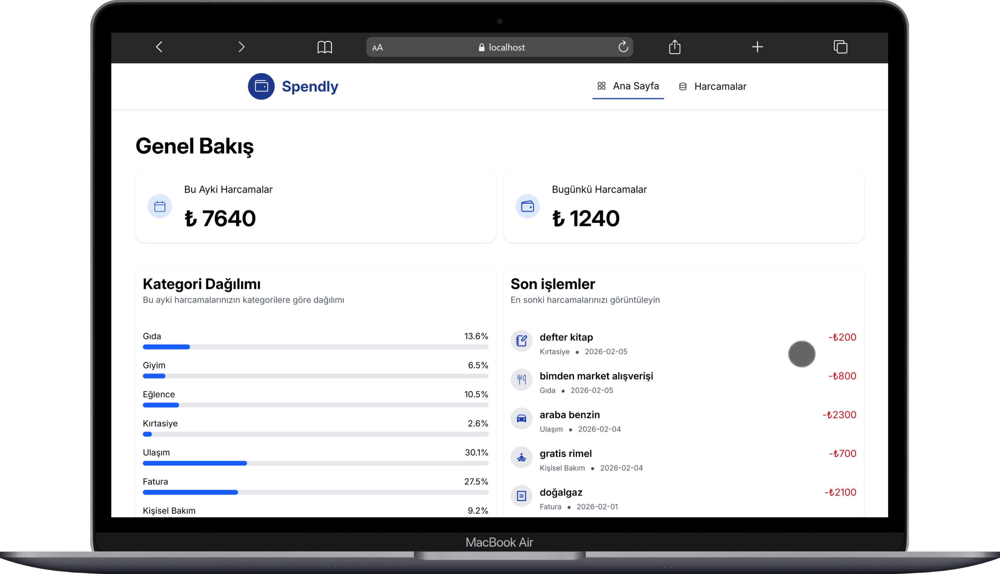
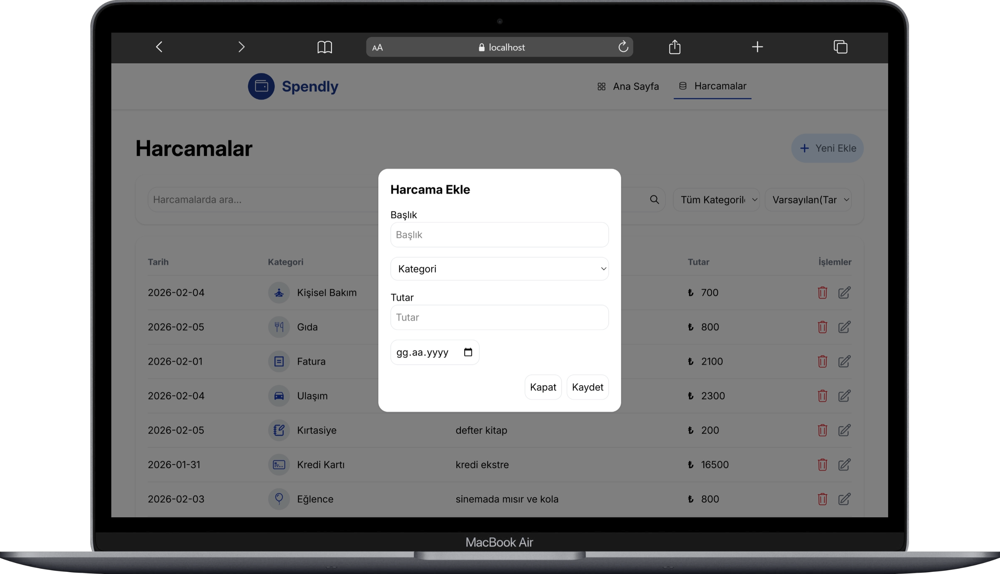
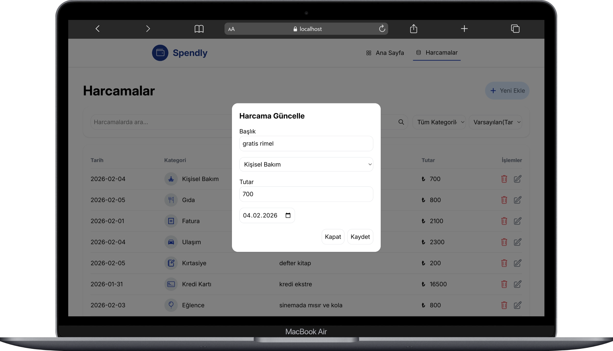
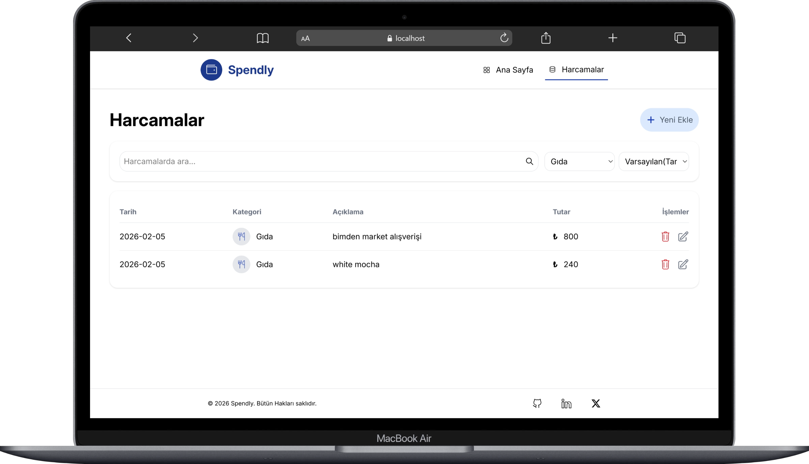
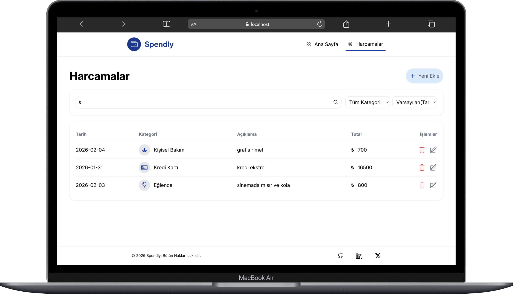
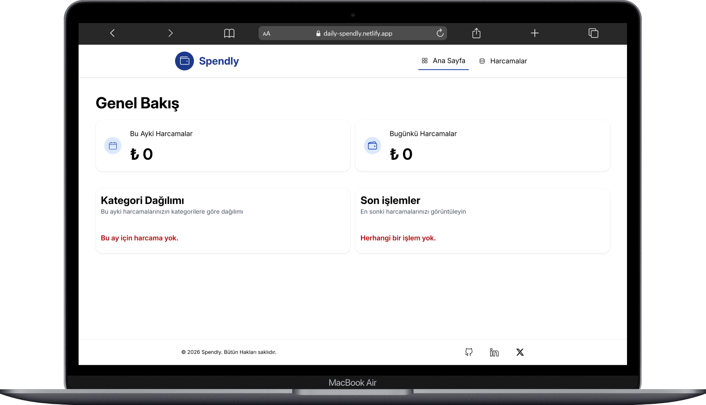
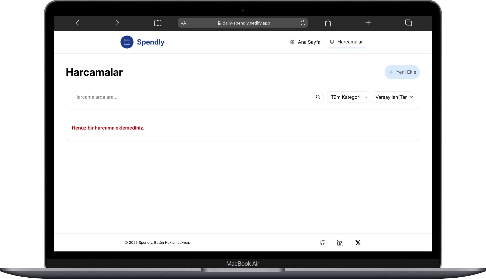
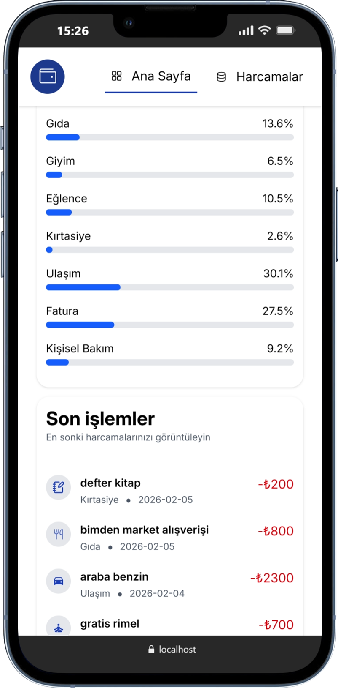
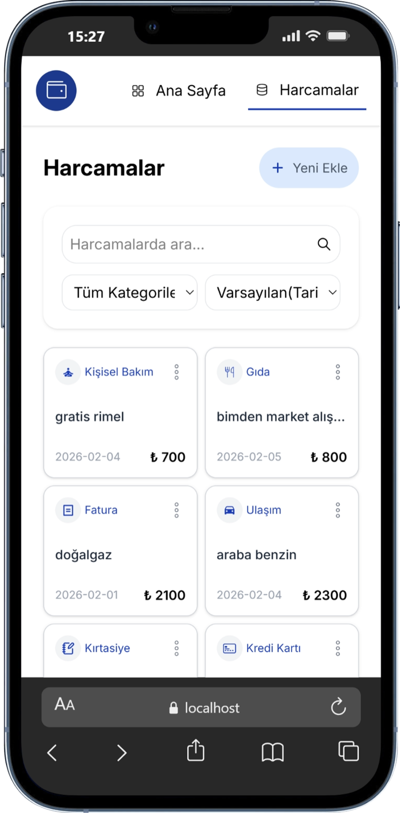
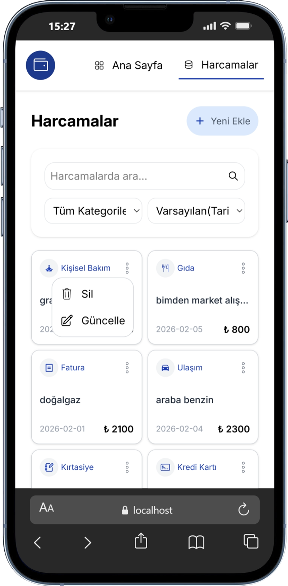

# 💰 Spendly

**Spendly** is a responsive expense tracking application built with **React**, focusing on clean state management, mobile-first UX, and real-world CRUD patterns.

The application provides **different UI experiences for desktop and mobile users** instead of forcing a single layout across all screen sizes.

---

## 🚀 Features

- Add, edit, and delete expenses
- Expense listing with date, category, description, and amount
- Search expenses by title
- Filter expenses by category
- Sort expenses by date
- Responsive design with mobile and desktop-specific layouts
- Mobile action menu for edit and delete operations
- Toast notifications for user feedback
- Context-aware empty state handling

---

## 📱 Responsive Design & Mobile UX

Spendly uses **separate UI strategies** for desktop and mobile screens.

### Desktop
- Table-based layout for better readability
- Inline edit and delete actions
- Optimized for data-heavy views

### Mobile
- Card-based layout optimized for touch interaction
- Compact action menu triggered by a kebab icon
- Item-based modal control (only one menu can be open at a time)
- Toggle behavior on repeated interaction
- Action menu closes automatically when the user interacts outside the menu

This approach improves usability and prevents accidental actions on mobile devices.

---

## 🖼️ Screenshots

### Desktop View









### Mobile View




---

## 🧠 State Management & UX Decisions

- Expense data is managed centrally using React `useState`
- Mobile menus are controlled using **item-based state** instead of boolean flags
- Toast notifications provide immediate feedback for user actions
- Empty state messages adapt dynamically to search and filter conditions
- Components are structured with clear separation of concerns

---

## 🔔 Notifications

User actions such as adding, updating, and deleting expenses trigger toast notifications using **react-toastify**, ensuring clear and non-intrusive user feedback.

---

## 🛠️ Tech Stack

- React
- React Router
- JavaScript (ES6+)
- Tailwind CSS
- React Icons
- React Toastify
- json-server (development only)

---

## 📦 Installation & Setup

git clone https://github.com/karakayaezgi/Spendly.git
cd Spendly
npm install
npm run server
npm run dev

## 🧪 Backend & Data Handling

During development, **json-server** is used as a mock REST API.

```bash
npm run server

